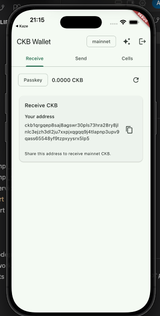

## Builder Track Weekly Report — Week 11

**Name:** Telesphore TUGANIMANA  
**Week Ending:** 07-09-2026

### Courses Completed

- **Updating the CKB Flutter package example app**
  - Updated the `ckb_flutter_client` example so it behaves like a working wallet demo, not a starter template.
  - Wired the example to the public package APIs: light-client RPC, header sync, lock-based cell queries, and capacity.
  - Added wallet screens for create mnemonic, receive, and send so the example exercises the full fund-and-spend path.
  - Follow the development of the package on [Ckb Flutter client](https://github.com/tuganimana/ckb-flutter-client)

- **Creating a mnemonic**
  - Implemented BIP-39 mnemonic generation (and restore) in the example onboarding flow.
  - Derived a secp256k1-blake160 lock from the mnemonic and encoded a fundable CKB address (`ckt1…` / `ckb1…`).
  - Showed the new address in the app so the wallet can be funded on testnet before receive/send.

- **Receive and send**
  - Receive: display the mnemonic-derived address (and lock) so CKB can be sent into the wallet.
  - After funding, query live cells / capacity for that lock via the light client (`set_scripts` / `get_cells`).
  - Send: build a transfer from those live cells, sign with the mnemonic key, and submit through the light-client RPC.
  - 
  - 

### Key Learnings

- **Example app as package surface**
  - The example app is how the Flutter package is actually tested: connect to a light-client RPC, sync headers, then receive and send against a real lock.
  - Keeping protocol/client code in `lib/` and UI in `example/` keeps the package reusable for Kaze and other Flutter apps.

- **Mnemonic → receive address**
  - A 12/24-word mnemonic derives a private key, then blake160 lock args, then a CKB address that can be funded.
  - The light client indexes by lock script, so the generated address/lock is what you register with `set_scripts` and query with `get_cells`.

- **Send from live cells**
  - Send is cell-based: pick live cells for the lock, assemble a transaction (inputs + change), sign, then send.
  - Receive and send share the same lock; the example must refresh capacity after each transfer so the UI matches chain state.

### Practical Progress

- Updated the `ckb_flutter_client` example app:
  - Replaced starter boilerplate with a focused wallet demo (RPC URL, header sync, mnemonic, receive, send).
  - Kept UI out of the package so `example/` is the only place that renders wallet screens.
- Creating mnemonic:
  - Generate or restore a mnemonic.
  - Derive lock args and a CKB address.
  - Persist the wallet in the example so receive/send use the same key.
- Receive:
  - Show the address as the receive target.
  - Register the lock with the light client and list live cells / capacity after funding.
- Send:
  - Collect destination address and amount.
  - Select cells, sign with the mnemonic key, submit the transaction, then refresh balance.
- Package work continues on [Ckb Flutter client](https://github.com/tuganimana/ckb-flutter-client)

### Environment Setup

- Same DigitalOcean Droplet + CKB infrastructure from previous weeks for chain/RPC reference.
- Local Flutter/Dart environment for `ckb_flutter_client` (package + updated example app).
- Local `ckb-light-client` RPC (`http://127.0.0.1:9000`) for header sync, receive cell queries, and send submission.
- Next step: fund the generated address on testnet, confirm receive via the light client, then complete send end-to-end from the example app.
