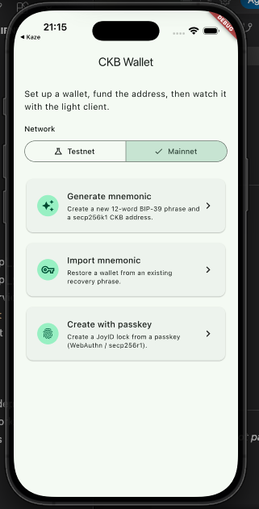
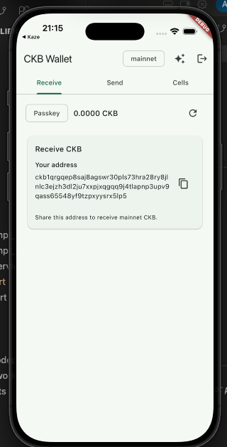

## Builder Track Weekly Final Report — Week 13

**Name:** Telesphore TUGANIMANA  
**Week Ending:** 21-09-2026

### Courses Completed

- **Package documentation**
  - Documented the open `ckb_flutter_client` package so other Flutter apps can adopt it without reading the source.
  - Covered setup (light-client RPC, Testnet / Mainnet), public APIs (connect, sync, query cells, receive, send), and how the example app uses them.
  - Wrote README / usage notes for mnemonic and passkey onboarding so the package surface is clear for Kaze and new integrators.
  - Follow the development of the package on [Ckb Flutter client](https://github.com/tuganimana/ckb-flutter-client)

- **Passkey on mnemonic create (example app)**
  - Added passkey to the **create mnemonic** flow in the package example: generate a seed, then protect it with a device passkey (Face ID / fingerprint / platform authenticator).
  - Wired create-mnemonic + passkey so the example can store and later unlock the mnemonic without leaving the seed in plain UI state.
  - Kept generate / import mnemonic and receive / send screens working on the same lock after passkey-backed setup.
  - 
  - 

- **Server cleanup**
  - Cleaned the DigitalOcean Droplet used through the track (CKB / Fiber / Docker lab stack).
  - Stopped unused containers and services, removed leftover images and volumes, and left the server in a tidy state after swap and wallet work.

### Key Learnings

- **Docs as the package surface**
  - A reusable Dart package needs a short path from README to a working wallet: RPC URL, sync, lock query, then sign and send.
  - Documenting mnemonic vs passkey in one place keeps Kaze and the public example on the same client API.

- **Passkey on create mnemonic**
  - Create mnemonic still derives a secp256k1-blake160 lock; passkey is the gate that protects that seed on device.
  - The light client still indexes the same lock; passkey does not change the CKB address, only how the example unlocks the key to sign.

- **Lab server lifecycle**
  - The Droplet was useful for CKB, Fiber, and swap reference; once the work is documented and the Flutter client is local, the remote stack should be stopped and cleaned.
  - Cleanup (stop services, drop unused Docker state) avoids leaving an open, costly lab node after the program.

### Practical Progress

- Package documentation:
  - README / usage for `ckb_flutter_client`: install, connect to `ckb-light-client`, sync, cells, capacity, receive/send.
  - Documented example onboarding: generate mnemonic, import mnemonic, passkey on create mnemonic; Testnet / Mainnet.
- Passkey on creating mnemonic:
  - Example create-wallet screen: generate mnemonic, register/unlock with passkey, then show the fundable CKB address.
  - Same receive / send / cells path after unlock; capacity refresh after funding.
- Server cleanup:
  - Stopped CKB / Fiber and related Docker services on the Droplet.
  - Removed unused images, volumes, and leftover lab files so the server is clean.
- Package work continues on [Ckb Flutter client](https://github.com/tuganimana/ckb-flutter-client)

### Review of Completed

- **Track:** CKB cells and txs → Rust wallet API → Fiber + RGB++ → Flutter light client → Kaze on-chain CKB↔BTC swap → docs, passkey on mnemonic, server cleanup.
- **Shipped:** address, mnemonic, transfer, balance/history API; Fiber CCH swaps; open Flutter CKB client + example wallet; package documentation.
- **This week:** documented the Flutter CKB package; added passkey to create-mnemonic in the example app; cleaned up the lab server.

### Environment Setup

- DigitalOcean Droplet cleaned this week (CKB / Fiber / Docker lab stack stopped and unused resources removed).
- Local Flutter/Dart environment for `ckb_flutter_client` (package docs + example wallet with passkey on mnemonic create).
- Local `ckb-light-client` RPC (`http://127.0.0.1:9000`) for header sync, cell queries, and send.

### Conclusion

This closing week focused on making the work reusable and tidy: documenting `ckb_flutter_client`, adding passkey protection when creating a mnemonic in the example app, and cleaning up the DigitalOcean lab server. I am happy to have completed the track with contributions to the Kaze self-custodial CKB wallet and the open Flutter CKB wallet client. Thank you.
