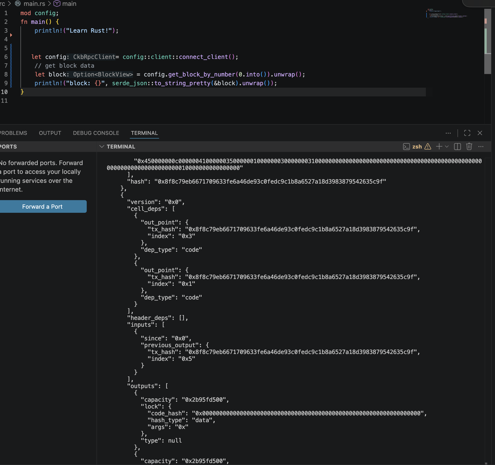
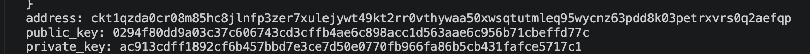

## Builder Track Weekly Report — Week 2

**Name:** Telesphore TUGANIMANA <br>
**Week Ending:** 06-07-2026

### Courses Completed

- **Smart Contracts**:
  - **Introduction to Scripts**:
    - Explored the fundamentals of the CKB-VM (Nervos Network Virtual Machine).
    - Studied the core **Script Structure**, which is defined as follows:
      ```json 
      {
        "code_hash": "HexString",
        "args": "HexString",
        "hash_type": "Uint8 (Allowed values: 0: 'data', 1: 'type', 2: 'data1')"
      }
      ```
    - Covered CKB-VM Syscalls and essential C helper functions.
    - Analyzed the key differences between the **CKB Cell Model**, **Bitcoin UTXO**, and **Ethereum Account** models.
    - Understood how CKB utilizes a **consume-and-create** state execution pattern.
    - Successfully completed Phase 1 and Phase 2 on the [Cell Model Explorer](https://website-sooty-chi-72.vercel.app/lessons/01-cell-model-explorer).

  - **CKB SDK**:
    - Initiated integration with the `ckb-rust-sdk` and successfully executed basic blockchain queries.
    - 
    - Mastered the logic behind address generation.
    - 
    - Continued deep-diving into advanced **Rust** development patterns.

### Key Learnings

- **Rust Language & CKB Concepts**:
  - Understanding cryptographic hashing mechanisms within CKB.
  - Core mechanics of Address Generation.
  - Rust data types, memory safety fundamentals, and syntax.

- **Project Initialization**:
  - Began building out the primary project architecture utilizing the `ckb-rust-sdk`.

### Practical Progress

- Successfully implemented the **address generation** logic.
- Achieved successful retrieval of live **block details** via SDK queries.
- Began researching and mapping out how to construct, sign, and broadcast a CKB transaction.

### Environment Setup

- Rust and Cargo toolchains fully installed.
- CKB local node and developer environments are completely installed and operational.
- Basic CLI tool usage and debugging workflows established.