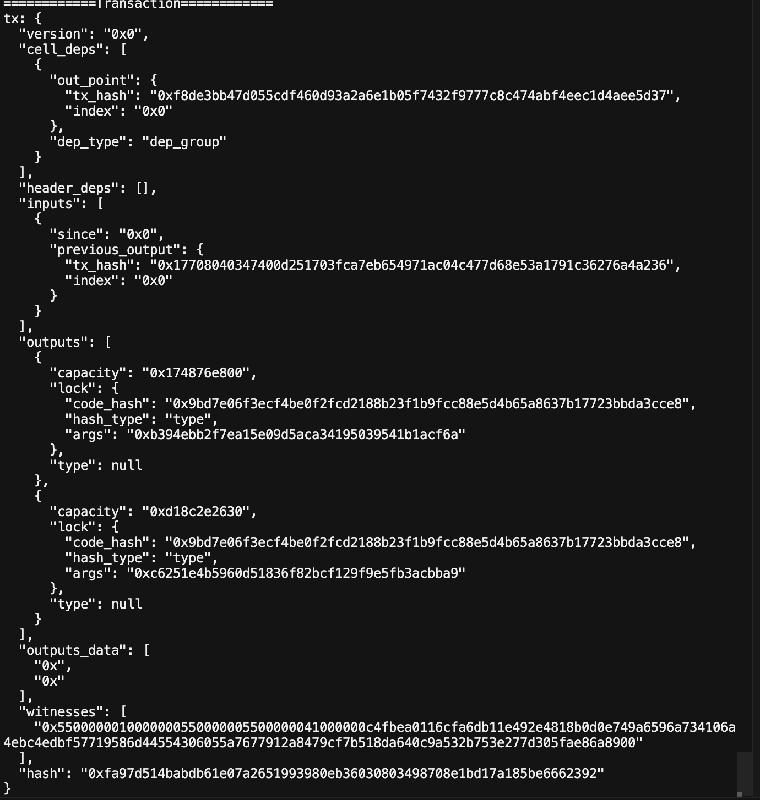
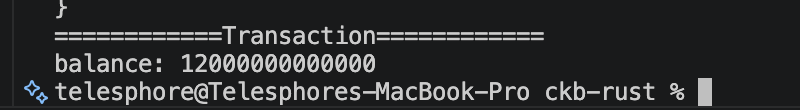
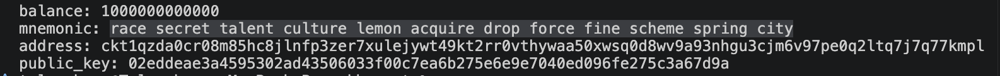

## Builder Track Weekly Report — Week 3

**Name:** Telesphore TUGANIMANA  
**Week Ending:** 13-07-2026

### Courses Completed

- **Build a Transaction**
  - **Understanding CKB Witness**
    - Connects to the CKB node.
    - Loads transaction dependencies.
    - Creates the output cell you want to send.
    - Finds input cells automatically.
    - Calculates change and transaction fees.
    - Builds an unsigned transaction.

- **CKB Transactions**
  - I also covered and dived into CKB addresses and how they are properly generated and parsed.
  - I learnt how to create transactions and perform transfers.
  - I understood how transaction inputs, outputs, and witnesses work together.
  - 
  - Mastered the logic behind `CellCollector` for retrieving wallet balance.
  - 

- **CKB Mnemonic Key**
  - I learnt how to use BIP-39 and XPrv to generate and manage wallets.
  - Generated addresses from a mnemonic phrase.
  - Learnt how multiple addresses can be derived from the same mnemonic.
  - 

### Key Learnings

- **Rust Framework & CKB Concepts**
  - Understood how to get an address balance using a mnemonic.
  - Started learning how to build REST APIs in Rust.
  - Continued reading more about the CKB Cell model and address formatting.
  - Better understood how the `CellCollector` works behind the scenes.

- **Project Initialization**
  - Began building the primary project architecture using the `ckb-rust-sdk`.

### Practical Progress

- Successfully implemented address generation from a mnemonic.
- Tested CKB transactions successfully.
- Implemented balance retrieval using `CellCollector`.
- Started working on the deposit flow.
- Continued experimenting with transaction building using the CKB Rust SDK.

### Environment Setup

- Rust and Cargo toolchains fully installed.
- CKB development environment configured and ready for development.