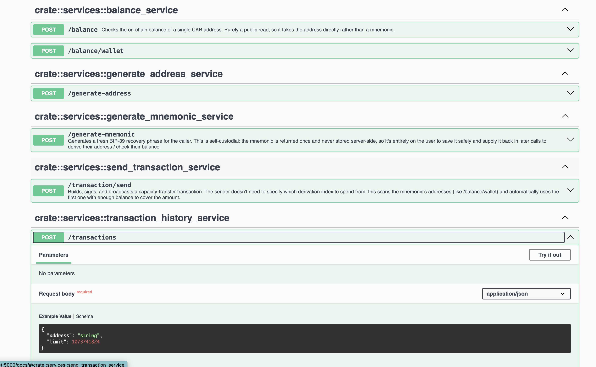
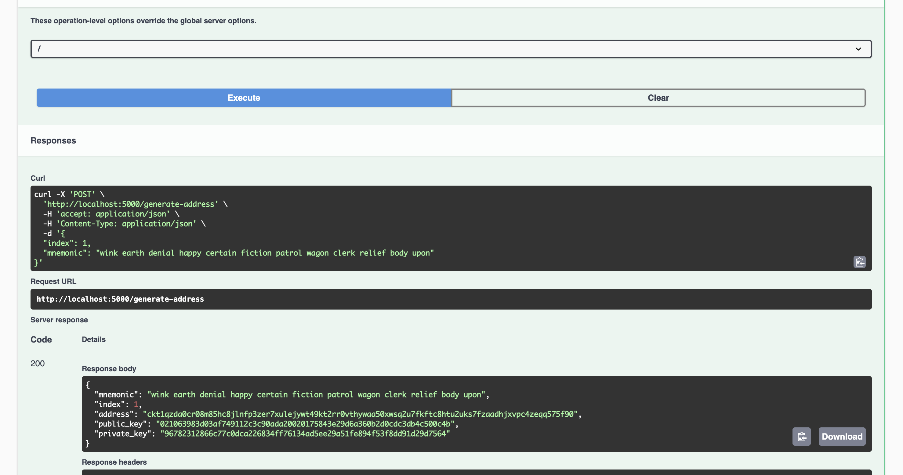

## Builder Track Weekly Report — Week 5

**Name:** Telesphore TUGANIMANA  
**Week Ending:** 27-07-2026

### Courses Completed

- **Deploy the app**
  - **Dockerize app**
    - Route requests to handlers in rust.
    - Declaratively parse requests using extractors.
    - Understand error handling model.
    - Generate responses with minimal boilerplate.
    - Take full advantage of the tower and tower-http ecosystem of middleware, services, and utilities.
    - able to run how serde works wiith json handling

    - Route requests to handlers in rust.
    - Declaratively parse requests using extractors.
    - Understand error handling model.
    - Generate responses with minimal boilerplate.
    - Take full advantage of the tower and tower-http ecosystem of middleware, services, and utilities.

- **Fiber Introducution**
  - I was able to run complete appi to generate mnnemonic
  - Generate address endpoint.
  - generate transfer (send ckb) endppoinnt .
  - 
  - Being able to get trasactio on address
  - 

### Key Learnings

- **Fiber**
  - Learn how to connect to fiber node  .
  - utopia for swagger docs.
  - Serde ( Serialization and deserialiization).
  - Todio.

### Practical Progress

- Successfully implemented address generation from a mnemonic usin API.
- Tested CKB transactions successfully through api.
- Implemented balance retrieval from Mnemnomic ( still in progress).

### Environment Setup

- Setting up railway for test deployment.
- Learning how to dockerize Rust project.
